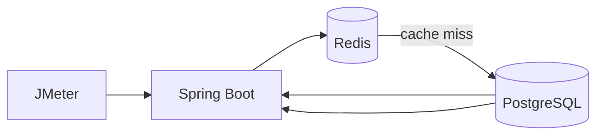

# High-Performance REST API with Caching & Load Testing

A Spring Boot REST API performance lab using **PostgreSQL, Redis, HikariCP and Apache JMeter**.

## Architecture


## Optimization path
- Baseline PostgreSQL lookup
- PostgreSQL index on the query path
- HikariCP connection-pool tuning
- Redis caching for repeated GET requests
- Identical JMeter workload for comparison

## Run
```bash
docker compose up -d
mvn spring-boot:run
jmeter -n -t loadtest/products.jmx -l results.jtl
```
API: `GET /api/products/{id}`

## Benchmark results
Numbers are intentionally **not fabricated**. They depend on the machine, Docker resources, database size and concurrency. Run the included JMeter plan and record the resulting average, P95 and throughput here.

| Version | Average latency | P95 latency | Throughput |
|---|---:|---:|---:|
| Baseline | pending measurement | pending | pending |
| Indexed + Hikari | pending measurement | pending | pending |
| Redis cached | pending measurement | pending | pending |

## Tests
```bash
mvn test
```

Docker Compose provides PostgreSQL and Redis.